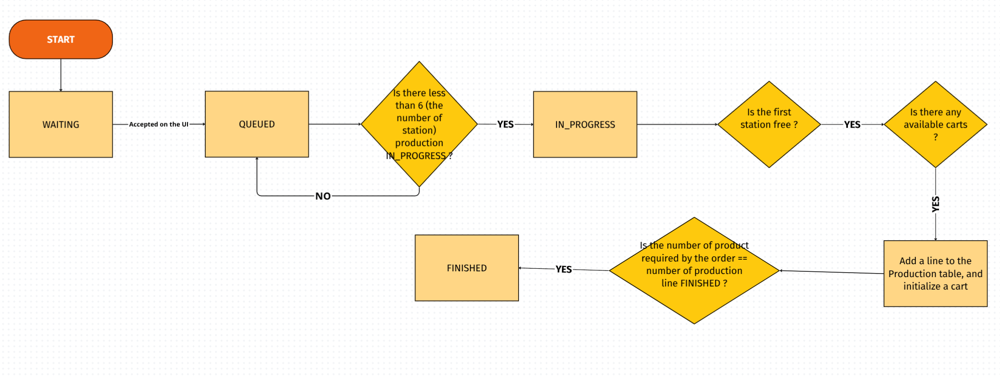
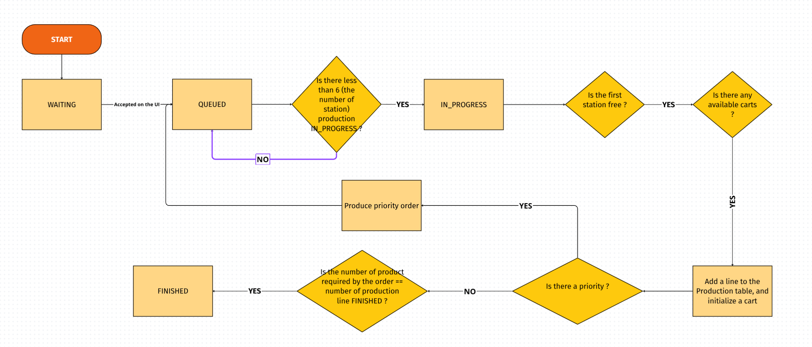

MESLab4_0
=========

### Startup Infrastructure DB

Run : docker compose up -d        

### Actualize Database Initialization

docker compose down -v

docker compose up -d

### Access to DataBase

Go to : http://localhost:8080/

* user : root
* Database : MES_POLIMI
* password : root_password

### Launch NodeRed

node-red -u <path_to_project_repository>/<name_of_project_repository>/NodeRed-MES

Go to : http://localhost:1880/#

### Access to UI

Go to :http://localhost:1880/ui

### UI Description

* User Interface : control the flow of production of the MES, accept order, developing tool to simulate the stations messages
* Register Order : allow to input new orders
* Enginering Interface : input new product type, initialize the line

### Description of the flow of production

* First you have to initialize the line. To do this go on the UI -> Enginering Interface, choose the number of carts and submit

* Then create orders :  UI -> Register Order

* Then validate WAITING order by clicking on them :  UI -> User Interface

To simulate the messages of the station for development purpose, you can use the station state interface : UI -> User Interface

##### Production flow of an Order :

* Without Priority : WAITING -> Acepted on the interface -> QUEUED -> Is there less than 6 (the number of station) production IN_PROGRESS ? -> IN_PROGRESS -> Is the first station free ? -> Is there any available carts ? -> Add a line to the Production table, and initialize a cart -> Is the number of product required by the order == number of production line FINISHED ? -> FINISHED

* If there is a priority : PAUSED every other QUEUED or IN_PROGRESS Orders, until all of the priority orders product are in a cart on the line, then the flow goes back to normal

##### Working flow of each station :

-> MES warns station that it will receives a cart

<- Station sends CART_IN signal

-> MES sends The instruction : Type of Action or Bypass (No station)

<- Station sends DONE

-> MES sends : Release the cart if next station is free, HOLD signal if it is not

<- If HOLD signal received, station retries DONE after some time

### Description of important Nodes

* Get Order Info : check if there are any commands QUEUED or IN_PROGRESS. It then prepare the iteration on all of those commands, and request the database for all of the needed informations for the next node

* Is Order Finished ? : It commandes the organization of the production process. It receives the informations from "Get Order Info". For each selected orders, it check if all the needed number production are already on the line, then if all of those production are finished, and finally if none of the previous checks are false it iterates to the next order

* Check If free space on line : check if there are still unused carts on the line based the total cart inputed at the initialization of the line

* Assign Cart : find a free cart if possible, then assign it to the needed production. Create the Serial Number of the production (for now the contraction of the order id and the actual time)

* Take decision : Responsible of the actualization of the state of the stations from the point of view of the line. It warns a station when it should expect the arrival of a cart. If the cart as reached the last station, it actualizes the Order in the DBn and finished the production by releasing the cart and make it available

* Acknowledge Physical Answer : receives and sorts the messages received by the stations. When it receives CART_IN from the station that he expected, it sends the instruction of the action, and send BYPASS otherwise (HOLD if next station not available). When it receives DONE from the station that he expected, it checks if the next station is free and sends the release signal if yes, HOLD if not. In the same time, it actualizes the station of the cart if needed. 
Evrytime it receives a signal, it checks if this cart in this precise station was expected to send this particular signal.

* Station 1 Priority Filter : Possibility of implementing a change of the type of product if still in the first station. It was planned for later so I deactivated it, but it may be useful later. To enable it, change the condition line 23, and you can use the global variable "production_priority" initialized in the node "Submit Initialization", line 21

### Change the number of stations

1) Actualise the database (table products)
2) Change the variable "nb_stations", line 2 of the node "Submit Initialization"
3) Adapt the form "Create new product"